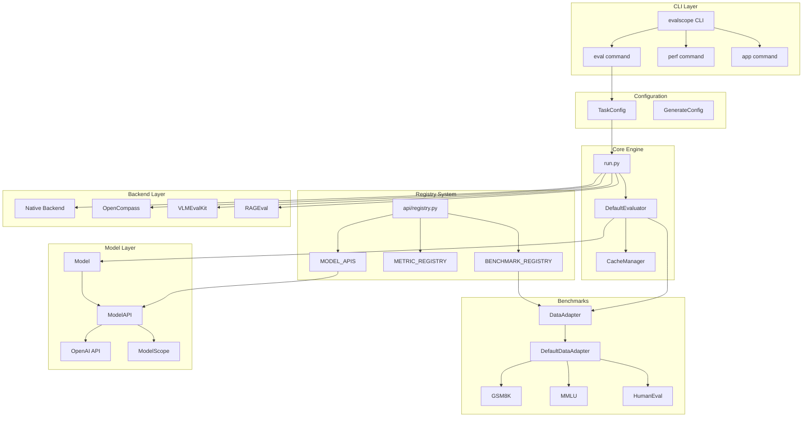
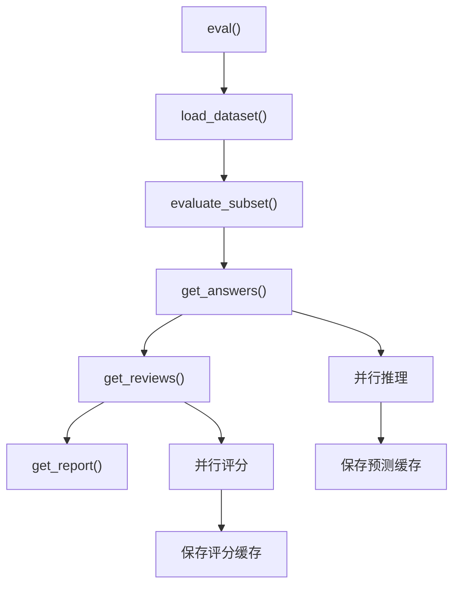

# EvalScope 技术架构文档

> EvalScope 是 ModelScope 社区开发的轻量级 LLM 评估框架，支持评估 LLM、VLM、Embedding 模型、Reranker 和 AIGC 模型。

---
## 第一部分：项目架构分析

### 1.1 项目目录树

```
evalscope/
├── __init__.py                 # 包入口，版本信息
├── version.py                  # 版本号定义
├── constants.py                # 全局常量定义
├── config.py                   # TaskConfig 配置类
├── run.py                      # 任务运行入口
├── arguments.py                # 命令行参数解析
│
├── api/                        # 模块化 API 层 (v1.0 重构)
│   ├── registry.py             # 全局注册表
│   ├── benchmark/              # DataAdapter 抽象基类
│   │   ├── benchmark.py        # DataAdapter 基类定义
│   │   ├── meta.py             # BenchmarkMeta 元数据类
│   │   └── adapters/           # 适配器实现
│   │       ├── default_data_adapter.py
│   │       ├── multi_choice_adapter.py
│   │       ├── vision_language_adapter.py
│   │       └── ...
│   ├── evaluator/              # Evaluator 基类和缓存
│   │   ├── evaluator.py        # Evaluator 抽象基类
│   │   ├── cache.py            # CacheManager 缓存管理
│   │   └── state.py            # TaskState 状态类
│   ├── metric/                 # Metric 和 Aggregator 基类
│   │   ├── metric.py           # Metric 抽象基类
│   │   └── scorer.py           # Score 评分类
│   ├── model/                  # Model 和 ModelAPI 类
│   │   ├── model.py            # Model/ModelAPI 基类
│   │   ├── generate_config.py  # GenerateConfig 生成配置
│   │   ├── lazy_model.py       # LazyModel 延迟加载
│   │   └── model_output.py     # ModelOutput 输出类
│   ├── dataset/                # 数据集加载器
│   ├── messages/               # ChatMessage 消息类
│   ├── filter/                 # 输出过滤器
│   ├── mixin/                  # 混入类 (LLMJudge, Sandbox)
│   └── tool/                   # 工具调用支持
│
├── benchmarks/                 # 100+ 评测基准实现
│   ├── gsm8k/                  # 数学推理基准
│   ├── mmlu/                   # 多任务语言理解
│   ├── humaneval/              # 代码生成评测
│   ├── ifeval/                 # 指令遵循评测
│   └── ...                     # 共 106 个评测基准
│
├── models/                     # 模型实现
│   ├── model_apis.py           # 模型 API 注册
│   ├── openai_compatible.py    # OpenAI 兼容 API
│   ├── modelscope.py           # ModelScope 模型加载
│   ├── mockllm.py              # Mock LLM 测试
│   └── text2image_model.py     # 文生图模型
│
├── evaluator/                  # 评估器实现
│   └── evaluator.py            # DefaultEvaluator 实现
│
├── metrics/                    # 评测指标实现
│   ├── t2v_metrics/            # 文生图评测指标
│   ├── bert_score/             # BERT Score
│   └── bundled_rouge_score/    # ROUGE Score
│
├── filters/                    # 输出过滤器实现
├── report/                     # 报告生成
├── utils/                      # 工具函数
│
├── backend/                    # 后端管理
│   ├── base.py                 # BackendManager 基类
│   ├── opencompass/            # OpenCompass 后端
│   ├── vlm_eval_kit/           # VLMEvalKit 后端
│   └── rag_eval/               # RAGEval 后端
│       ├── cmteb/              # MTEB 评测
│       ├── clip_benchmark/     # CLIP 评测
│       └── ragas/              # RAGAS 评测
│
├── cli/                        # 命令行接口
│   ├── cli.py                  # 主入口
│   ├── start_eval.py           # eval 子命令
│   ├── start_perf.py           # perf 子命令
│   ├── start_app.py            # app 子命令
│   └── start_service.py        # service 子命令
│
├── app/                        # WebUI 可视化应用
│   ├── app.py                  # Gradio 应用入口
│   └── ui/                     # UI 组件
│
├── perf/                       # 性能压测模块
└── third_party/                # 第三方工具集成
    ├── longbench_write/
    ├── thinkbench/
    └── toolbench_static/
```

### 1.2 核心模块及职责

| 模块 | 职责 | 关键文件 |
|------|------|----------|
| `api/` | 模块化 API 层，定义核心抽象 | `registry.py`, `benchmark.py`, `evaluator.py` |
| `benchmarks/` | 106 个评测基准实现 | 每个子目录对应一个基准 |
| `models/` | 模型加载和推理 | `model_apis.py`, `openai_compatible.py` |
| `evaluator/` | 评估流程编排 | `evaluator.py` |
| `backend/` | 非原生后端集成 | OpenCompass, VLMEvalKit, RAGEval |
| `cli/` | 命令行接口 | `cli.py`, `start_*.py` |
| `config.py` | 任务配置管理 | TaskConfig 数据类 |
| `run.py` | 任务执行入口 | `run_task()`, `evaluate_model()` |

### 1.3 模块依赖关系图



### 1.4 数据流图

```mermaid
flowchart LR
    subgraph Input["输入"]
        cli_args["CLI 参数"]
        yaml_config["YAML 配置"]
        dict_config["Dict 配置"]
    end

    subgraph Parse["解析"]
        parse_config["parse_task_config()"]
        task_config["TaskConfig"]
    end

    subgraph Execute["执行"]
        run_task["run_task()"]
        setup_dir["setup_work_directory()"]
        run_single["run_single_task()"]
    end

    subgraph Evaluate["评估"]
        get_benchmark["get_benchmark()"]
        evaluator["DefaultEvaluator"]
        load_dataset["load_dataset()"]
        get_answers["get_answers()"]
        get_reviews["get_reviews()"]
    end

    subgraph Score["评分"]
        calc_metrics["calculate_metrics()"]
        agg_scores["aggregate_scores()"]
        gen_report["generate_report()"]
    end

    subgraph Output["输出"]
        predictions["predictions/"]
        reviews["reviews/"]
        reports["reports/"]
    end

    cli_args & yaml_config & dict_config --> parse_config
    parse_config --> task_config
    task_config --> run_task
    run_task --> setup_dir --> run_single
    run_single --> get_benchmark --> evaluator
    evaluator --> load_dataset --> get_answers --> get_reviews
    get_reviews --> calc_metrics --> agg_scores --> gen_report
    get_answers --> predictions
    get_reviews --> reviews
    gen_report --> reports
```



### 1.5 技术栈与关键依赖

| 组件 | 技术栈 | 用途 |
|------|--------|------|
| 核心框架 | Python 3.10+ | 主要开发语言 |
| 数据验证 | Pydantic | 配置验证和数据模型 |
| 模型加载 | ModelScope | 模型和数据集下载 |
| API 兼容 | OpenAI SDK | OpenAI 兼容 API |
| WebUI | Gradio | 可视化界面 |
| 后端集成 | OpenCompass, VLMEvalKit | 扩展评测能力 |

---

## 第二部分：模块详细说明

### 2.1 Registry 系统 (`evalscope/api/registry.py`)

Registry 系统是 EvalScope 的核心设计模式，采用装饰器注册机制实现组件的动态注册和获取。

**关键注册表：**

```python
BENCHMARK_REGISTRY: Dict[str, 'BenchmarkMeta'] = {}  # 评测基准注册表
MODEL_APIS: Dict[str, Type['ModelAPI']] = {}         # 模型 API 注册表
METRIC_REGISTRY: Dict[str, Type['Metric']] = {}      # 评测指标注册表
FILTER_REGISTRY: Dict[str, Type['Filter']] = {}      # 过滤器注册表
AGGREGATION_REGISTRY: Dict[str, Type['Aggregator']] = {}  # 聚合器注册表
```

**注册装饰器使用示例：**

```python
# 注册评测基准 (evalscope/benchmarks/gsm8k/gsm8k_adapter.py:26)
@register_benchmark(
    BenchmarkMeta(
        name='gsm8k',
        dataset_id='AI-ModelScope/gsm8k',
        metric_list=[{'acc': {'numeric': True}}],
        ...
    )
)
class GSM8KAdapter(DefaultDataAdapter):
    ...

# 注册评测指标
@register_metric(name='acc')
class AccuracyMetric(Metric):
    ...

# 注册模型 API
@register_model_api(name='openai_api')
class OpenAICompatibleAPI(ModelAPI):
    ...
```

### 2.2 TaskConfig 配置系统 (`evalscope/config.py:30`)

TaskConfig 是核心配置数据类，包含 30+ 参数，分为以下几组：

**模型参数：**
| 参数 | 类型 | 说明 |
|------|------|------|
| `model` | str/Model/ModelAPI | 模型路径或对象 |
| `model_id` | str | 模型唯一标识 |
| `model_args` | Dict | 模型初始化参数 |
| `model_task` | str | 任务类型 (text_generation/image_generation) |

**数据集参数：**
| 参数 | 类型 | 说明 |
|------|------|------|
| `datasets` | List[str] | 评测数据集列表 |
| `dataset_args` | Dict | 数据集特定参数 |
| `dataset_hub` | str | 数据源 (modelscope/huggingface/local) |
| `limit` | int/float | 样本数量限制 |

**评测参数：**
| 参数 | 类型 | 默认值 | 说明 |
|------|------|--------|------|
| `eval_type` | str | None | 评测类型 (llm_ckpt/openai_api/mock_llm) |
| `eval_backend` | str | Native | 评测后端 |
| `eval_batch_size` | int | 1 | 批处理大小 |
| `use_cache` | str | None | 缓存目录 |
| `work_dir` | str | ./outputs | 输出目录 |

### 2.3 DataAdapter 基类 (`evalscope/api/benchmark/benchmark.py:24`)

DataAdapter 是所有评测基准的抽象基类，定义了评测流程的核心接口：

```python
class DataAdapter(LLMJudgeMixin, SandboxMixin, ABC):
    @abstractmethod
    def load_dataset(self) -> DatasetDict:
        """加载评测数据集"""
        pass

    @abstractmethod
    def run_inference(self, model: Model, sample: Sample, output_dir: str) -> TaskState:
        """执行模型推理"""
        pass

    @abstractmethod
    def calculate_metrics(self, task_state: TaskState) -> SampleScore:
        """计算评测指标"""
        pass

    @abstractmethod
    def aggregate_scores(self, sample_scores: List[SampleScore]) -> List[AggScore]:
        """聚合样本分数"""
        pass

    @abstractmethod
    def generate_report(self, scores, model_name, output_dir) -> Report:
        """生成评测报告"""
        pass
```

### 2.4 DefaultEvaluator 评估器 (`evalscope/evaluator/evaluator.py:33`)

DefaultEvaluator 编排完整的评估流程：



**核心方法：**
- `eval()`: 主入口，编排整个评估流程
- `get_answers()`: 获取模型预测，支持缓存和并行
- `get_reviews()`: 计算评测指标，支持批量评分
- `get_report()`: 生成评测报告

### 2.5 Model 和 ModelAPI (`evalscope/api/model/model.py`)

**ModelAPI (抽象基类，第 19 行)：**
```python
class ModelAPI(abc.ABC):
    def __init__(self, model_name, base_url, api_key, config):
        ...

    @abstractmethod
    def generate(self, input, tools, tool_choice, config) -> ModelOutput:
        """生成模型输出"""
        ...
```

**Model (封装类，第 133 行)：**
```python
class Model:
    def __init__(self, api: ModelAPI, config: GenerateConfig):
        self.api = api
        self.config = config

    def generate(self, input, tools, tool_choice, config) -> ModelOutput:
        """预处理输入并调用 API"""
        ...
```

### 2.6 Backend 后端系统

支持四种评测后端：

| 后端 | 说明 | 配置键 |
|------|------|--------|
| Native | 原生评测引擎 | `eval_backend='Native'` |
| OpenCompass | 上海 AI Lab 评测框架 | `eval_backend='OpenCompass'` |
| VLMEvalKit | 视觉语言模型评测 | `eval_backend='VLMEvalKit'` |
| RAGEval | RAG 评测 (MTEB, CLIP) | `eval_backend='RAGEval'` |

---

## 第三部分：快速上手指南

### 3.1 环境准备

**系统要求：**
- Python >= 3.10
- CUDA >= 11.8 (GPU 评测)
- 内存 >= 16GB (推荐 32GB)

**安装步骤：**

```bash
# 基础安装
pip install evalscope

# 开发环境安装
git clone https://github.com/modelscope/evalscope.git
cd evalscope
pip install -e .
make dev  # 安装 dev/perf/docs 依赖 + pre-commit hooks

# 可选功能安装
pip install 'evalscope[perf]'        # 性能压测
pip install 'evalscope[opencompass]' # OpenCompass 后端
pip install 'evalscope[vlmeval]'     # VLMEvalKit 后端
pip install 'evalscope[rag]'         # RAG 评测
pip install 'evalscope[all]'         # 全部功能
```

**环境变量配置：**

```bash
# 数据集缓存目录
export EVALSCOPE_CACHE=~/.cache/evalscope

# ModelScope 配置
export MODELSCOPE_CACHE=~/.cache/modelscope

# API 密钥 (如使用 OpenAI 兼容 API)
export OPENAI_API_KEY=your-api-key
```

### 3.2 项目启动流程

**CLI 命令一览：**

```bash
# 查看帮助
evalscope --help
evalscope eval --help

# 本地模型评测
evalscope eval \
  --model Qwen/Qwen2.5-0.5B-Instruct \
  --datasets gsm8k arc \
  --limit 5

# API 服务评测
evalscope eval \
  --model qwen2.5 \
  --eval-type openai_api \
  --api-url http://127.0.0.1:8801/v1 \
  --datasets gsm8k mmlu

# 性能压测
evalscope perf \
  --url http://127.0.0.1:8801/v1/chat/completions \
  --api openai \
  --model qwen2.5 \
  --parallel 5 \
  -n 20

# 启动可视化 WebUI
evalscope app
```

**Python API 使用：**

```python
from evalscope.run import run_task
from evalscope.config import TaskConfig

# 方式 1: 使用 TaskConfig
config = TaskConfig(
    model='Qwen/Qwen2.5-0.5B-Instruct',
    datasets=['gsm8k', 'arc'],
    limit=10,
    eval_batch_size=4,
)
results = run_task(config)

# 方式 2: 使用字典配置
results = run_task({
    'model': 'Qwen/Qwen2.5-0.5B-Instruct',
    'datasets': ['gsm8k'],
    'limit': 10,
})

# 方式 3: 使用 YAML 配置文件
results = run_task('config.yaml')
```

### 3.3 常见问题与解决方案

| 问题 | 解决方案 |
|------|----------|
| 模型下载失败 | 检查网络，或使用 `dataset_hub='huggingface'` |
| CUDA 内存不足 | 减小 `eval_batch_size` 或使用 API 模式 |
| 评测结果不一致 | 设置 `seed=42` 确保可复现 |
| 缓存占用过大 | 清理 `~/.cache/evalscope` |

---

## 第四部分：深入学习路线

### 4.1 代码阅读顺序

**阶段 1：理解核心流程（必读）**
1. `evalscope/cli/cli.py` - CLI 入口
2. `evalscope/config.py` - 配置系统
3. `evalscope/run.py` - 任务执行
4. `evalscope/api/registry.py` - 注册机制

**阶段 2：理解评估流程（必读）**
1. `evalscope/evaluator/evaluator.py` - 评估器实现
2. `evalscope/api/benchmark/benchmark.py` - DataAdapter 抽象
3. `evalscope/api/benchmark/adapters/default_data_adapter.py` - 默认适配器

**阶段 3：理解模型系统（可选）**
1. `evalscope/api/model/model.py` - Model/ModelAPI
2. `evalscope/models/openai_compatible.py` - OpenAI 兼容实现

**阶段 4：理解具体评测基准（可选）**
1. `evalscope/benchmarks/gsm8k/` - 数学推理示例
2. `evalscope/benchmarks/humaneval/` - 代码生成示例

### 4.2 核心概念解释

**TaskConfig**：评测任务的完整配置，包含模型、数据集、评测参数等。

**DataAdapter**：评测基准的数据适配器，负责数据加载、推理执行、指标计算。

**BenchmarkMeta**：评测基准的元数据，定义数据集、指标、提示模板等。

**TaskState**：单个样本的评测状态，包含输入、输出、元数据。

**SampleScore**：单个样本的评分结果。

**AggScore**：聚合后的评分结果（如平均分）。

### 4.3 二次开发指南

#### 添加新的评测基准

```python
# evalscope/benchmarks/my_benchmark/__init__.py

from evalscope.api.benchmark import BenchmarkMeta, DefaultDataAdapter
from evalscope.api.registry import register_benchmark

PROMPT_TEMPLATE = "{question}\nAnswer:"

@register_benchmark(
    BenchmarkMeta(
        name='my_benchmark',
        dataset_id='my-org/my-dataset',
        metric_list=['acc'],
        subset_list=['default'],
        eval_split='test',
        prompt_template=PROMPT_TEMPLATE,
    )
)
class MyBenchmarkAdapter(DefaultDataAdapter):

    def record_to_sample(self, record):
        """将原始数据转换为 Sample 对象"""
        from evalscope.api.dataset import Sample
        return Sample(
            input=record['question'],
            target=record['answer'],
        )

    def extract_answer(self, prediction, task_state):
        """从模型输出中提取答案"""
        return prediction.strip()
```

#### 添加新的评测指标

```python
# evalscope/metrics/my_metric.py

from evalscope.api.metric import Metric
from evalscope.api.registry import register_metric

@register_metric(name='my_metric')
class MyMetric(Metric):

    def apply(self, predictions, references):
        """计算评测指标"""
        scores = []
        for pred, ref in zip(predictions, references):
            score = 1.0 if pred.lower() == ref.lower() else 0.0
            scores.append(score)
        return scores
```

#### 添加新的模型 API

```python
# evalscope/models/my_api.py

from evalscope.api.model import ModelAPI, ModelOutput
from evalscope.api.registry import register_model_api

@register_model_api(name='my_api')
class MyModelAPI(ModelAPI):

    def generate(self, input, tools, tool_choice, config):
        """调用模型 API 生成输出"""
        # 实现模型调用逻辑
        response = self._call_api(input)
        return ModelOutput(
            completion=response['text'],
            message=response['message'],
        )
```

---

## 检查清单

### 第一部分检查清单
- [ ] 理解项目目录结构
- [ ] 理解 Registry 注册机制
- [ ] 理解核心数据流
- [ ] 理解模块间依赖关系

### 第二部分检查清单
- [ ] 理解 TaskConfig 配置参数
- [ ] 理解 DataAdapter 抽象接口
- [ ] 理解 DefaultEvaluator 评估流程
- [ ] 理解 Model/ModelAPI 模型抽象

### 第三部分检查清单
- [ ] 成功安装 EvalScope
- [ ] 运行基础评测命令
- [ ] 使用 Python API 运行评测
- [ ] 理解输出目录结构

### 第四部分检查清单
- [ ] 按顺序阅读核心代码
- [ ] 理解核心概念
- [ ] 成功添加自定义评测基准
- [ ] 成功添加自定义评测指标

---

## 附录：重要文件索引

| 文件路径 | 说明 |
|----------|------|
| `evalscope/run.py:19` | `run_task()` 任务入口 |
| `evalscope/run.py:112` | `evaluate_model()` 原生评测 |
| `evalscope/config.py:30` | `TaskConfig` 配置类 |
| `evalscope/api/registry.py:16` | `register_benchmark()` |
| `evalscope/api/registry.py:59` | `register_model_api()` |
| `evalscope/api/registry.py:98` | `register_metric()` |
| `evalscope/api/benchmark/benchmark.py:24` | `DataAdapter` 基类 |
| `evalscope/api/benchmark/adapters/default_data_adapter.py:21` | `DefaultDataAdapter` |
| `evalscope/evaluator/evaluator.py:33` | `DefaultEvaluator` |
| `evalscope/api/model/model.py:19` | `ModelAPI` 基类 |
| `evalscope/api/model/model.py:133` | `Model` 封装类 |
| `evalscope/api/metric/metric.py:10` | `Metric` 基类 |

---

> 文档生成时间：2025-12-07
> EvalScope 版本：基于 main 分支
